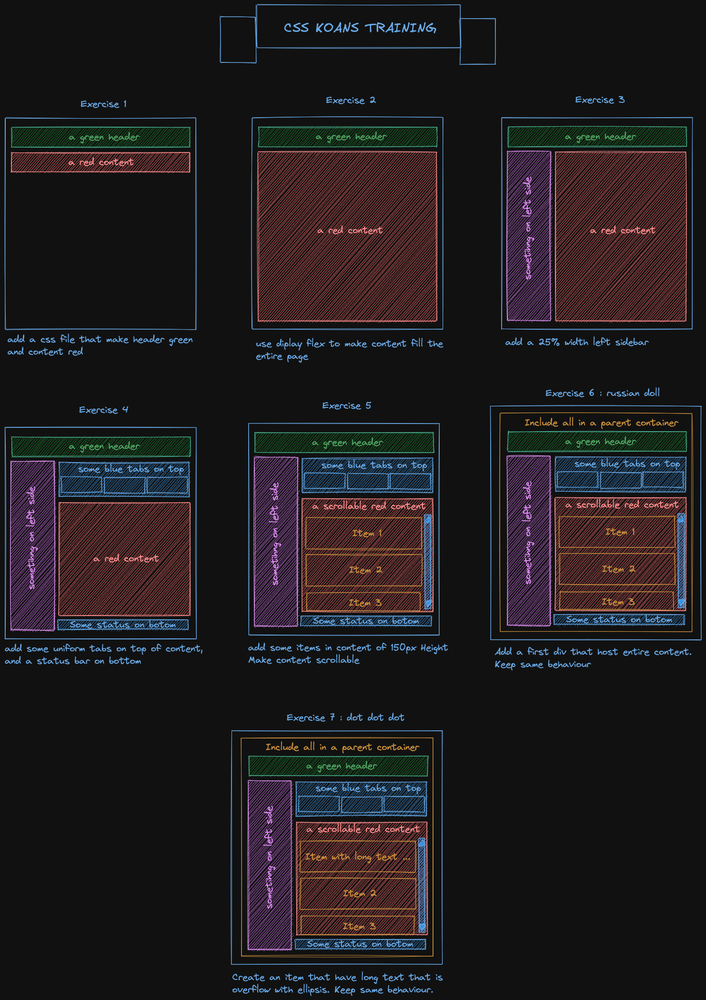

CSS KOANS KATA - FLEX
=======================

The objective of these exercices is to become more confortable with css flex manipulation.

1. *Start*: add a css file that make header green and content red.
2. *Flex:* use diplay flex to make content fill the entire page.
3. *Side bar:* add a 25% width left sidebar.
4. *Tab & status:* add some uniform tabs on top of content, and a status bar on bottom.
5. *Scroll:* add some items in content of 150px Height. Make content scrollable.
6. *Russian doll:* add a first div that host entire content. Keep same behaviour.
7. *Dot dot dot:* Create an item that have a long text that is overflow with ellipsis. Keep same behaviour.

Resources
---------
 - [A Complete Guide to Flexbox](https://css-tricks.com/snippets/css/a-guide-to-flexbox/)
 - [Flexbox and Truncated Text](https://css-tricks.com/flexbox-truncated-text/)

